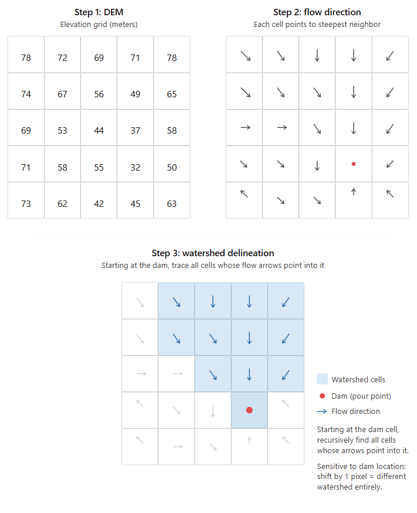
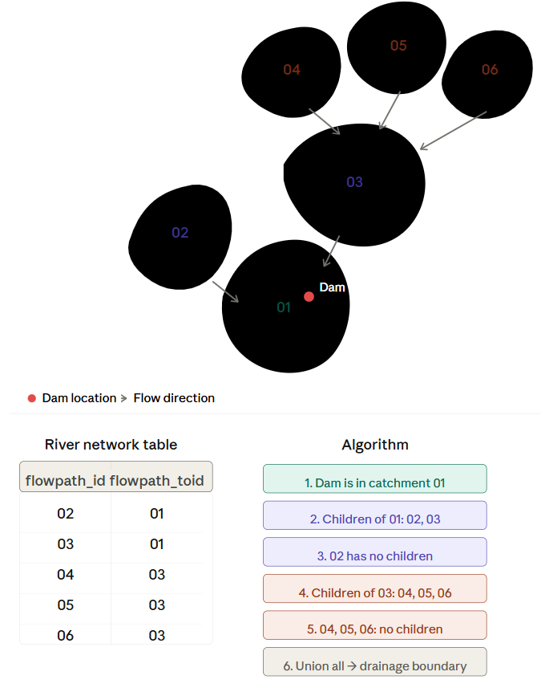
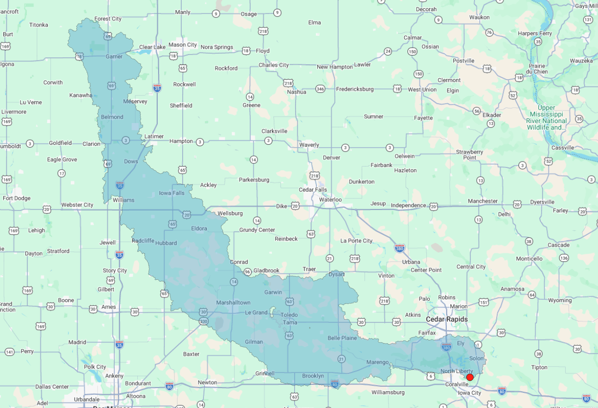
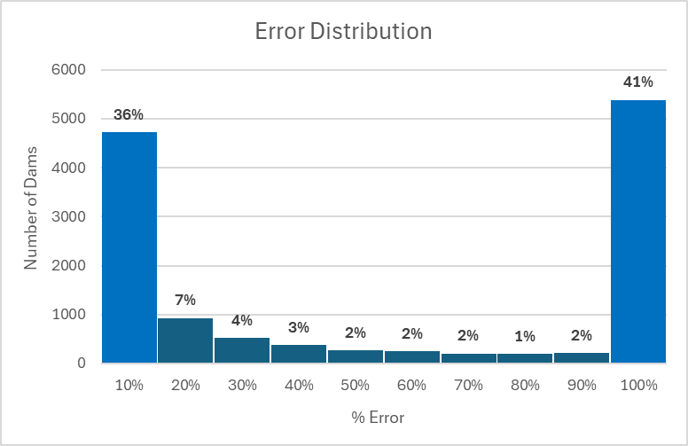
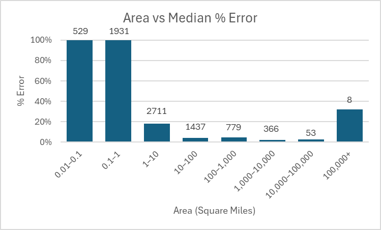
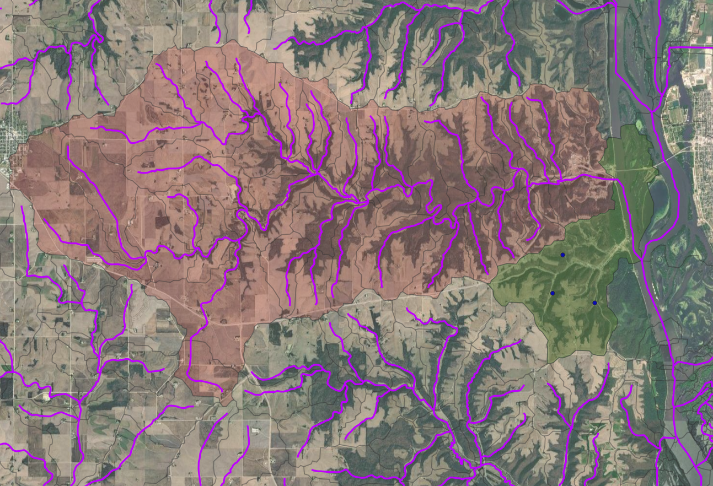

# Small Dam Drainage Area Delineation

Compute upstream drainage boundaries for high-hazard small dams across CONUS using the NOAA NextGen Hydrofabric river network and catchment polygons.

## Motivation

When a dam fails, the consequences depend on how much water is impounded behind it. The drainage boundary — the full upstream area whose precipitation eventually flows into a dam — is the key input for estimating that volume. For high-hazard dams (those where failure would likely cause loss of life), accurate drainage boundaries are critical for risk assessment and emergency planning.

This project computes those boundaries for ~17,000 high-hazard small dams in the National Inventory of Dams (NID).

## Why Hydrofabric Instead of DEM-Based Delineation?

The traditional approach uses a Digital Elevation Model (DEM) with a D8 flow direction matrix:

1. Start with a DEM grid where each pixel represents elevation
2. For each cell, compute the slope to all 8 neighbors and assign flow direction toward the steepest descent
3. Starting at the dam's pixel, recursively trace all cells whose flow arrows point into it


<p align="center"><em>Traditional DEM-based watershed delineation: compute elevation grid, derive D8 flow directions, then trace all cells draining to the pour point.</em></p>

The problem is that **this method is extremely sensitive to the dam's exact coordinates**. The NID small dams dataset has positional errors of ~30–50 meters — shifting the pour point by even one DEM pixel can produce a completely different watershed.

The Hydrofabric approach avoids this by assigning each dam to a **catchment polygon** rather than a single raster cell. These polygons are much larger than a DEM pixel, so minor coordinate errors don't produce drastically different results.

## Dataset

All data comes from the [NOAA NextGen Hydrofabric v2.2](https://proxy.lynker-spatial.com/hydrofabric/v2.3/superconus/cn/), partitioned by state/region as Parquet files.

**Catchments** (`catchments/*.parquet`) — The landscape divided into small hydrologic units (polygons), each draining to a single point. Each has a unique `flowpath_id` and a `geom` column (WKB, EPSG:5070).

**River Network** (`network/*.parquet`) — A connectivity table (no geometry) describing hydrologic connections between catchments. Each record maps an upstream catchment (`flowpath_id`) to its immediate downstream neighbor (`flowpath_toid`).

**Small Dams** — Point locations from the [National Inventory of Dams](https://nid.sec.usace.army.mil/nid/#/). Each dam has a Federal ID and coordinates. Only dams with Hazard Potential Classification = "High" are processed.

## Algorithm

The pipeline has three steps, each implemented as a separate script using multiprocessing:

### Step 1: Assign Dams to Catchments (`assign_dams.py`)

For each state's catchment Parquet file, build an STRtree spatial index. Point-in-polygon query each high-hazard dam to find which catchment contains it. Outputs `dam_flowpaths.csv` mapping each `dam_id` to its `flowpath_id`.

### Step 2: Traverse Upstream Network (`find_descendants.py`)

For each dam's `flowpath_id`, perform a BFS traversal up the river network tree: find all direct children (upstream catchments), then their children, and so on until reaching headwaters. Outputs `dam_flowpath_descendants.csv` with all ancestor `flowpath_id`s for each dam.

### Step 3: Combine Catchment Geometries (`combine_features.py`)

For each dam, load the WKB geometries of all its upstream catchments, run `make_valid` to fix any topology issues, then `unary_union` them into a single polygon. Write each result as `outputs/{dam_id}.geojson` (EPSG:5070).


<p align="center"><em>Hydrofabric-based approach: identify the dam's catchment, traverse upstream through the river network via BFS, then union all visited catchment geometries into the drainage boundary.</em></p>

## Setup
Requires Python 3.13.

```bash
conda env create -f environment.yml
conda activate small-dam-drainage-area
```

## Dependencies
Key libraries (all included in `environment.yml`):

- **PyArrow** — reads the Hydrofabric Parquet files without loading them into pandas, keeping memory usage low when processing large state-level datasets
- **Shapely** — handles all geometry operations: spatial indexing (STRtree) for dam-to-catchment assignment, `make_valid` for fixing topology issues, and `unary_union` for merging catchments into drainage boundaries
- **PyProj** — coordinate reference system handling (the Hydrofabric uses EPSG:5070 / NAD83 CONUS Albers)
- **NumPy** — array operations underlying Shapely and PyArrow

## Usage

Run the scripts in order:

```bash
python assign_dams.py
python find_descendants.py
python combine_features.py
```

## Project Structure

```
├── catchments/          # Hydrofabric catchment Parquet files (per state)
├── network/             # Hydrofabric network Parquet files (per state)
├── outputs/             # Generated GeoJSON drainage boundaries
├── assign_dams.py       # Step 1: Dam → catchment assignment
├── find_descendants.py  # Step 2: Upstream network traversal
├── combine_features.py  # Step 3: Geometry union → GeoJSON
├── small_dams_5070.csv  # Input dam locations (EPSG:5070)
├── environment.yml      # Conda environment
└── README.md
```

## Results
Each dam produced a GeoJSON file containing its upstream drainage boundary.

*Drainage boundary for dam IA00012 (red dot) near Iowa City. The computed upstream area covers approximately 8,052 km².*

## Preparing Data for the Web

The pipeline outputs GeoJSON in EPSG:5070 (NAD83 CONUS Albers), which is ideal for area calculations but not directly usable by web mapping libraries. Two additional steps convert the data for use with the Google Maps JavaScript API.

### Step 1: Reproject to WGS 84 (`reproject_output.py`)

Google Maps expects coordinates in EPSG:4326 (WGS 84 — latitude/longitude). This script reprojects each GeoJSON file from EPSG:5070 to EPSG:4326 using PyProj's `Transformer`, preserving the original polygon structure.
```bash
python reproject_output.py
```

Outputs reprojected files to `reprojected_outputs/`.

### Step 2: Convert to Protocol Buffers (`geojson_to_pbf.py`)

Converting to Protocol Buffer format (`.pbf`) significantly reduces file size
compared to verbose GeoJSON text, making network transfer to the client faster.
```bash
python geojson_to_pbf.py
```

Outputs `.pbf` files.


### Step 3: Visualize in the Browser

Install the required npm packages:
```bash
npm install @googlemaps/js-api-loader pbf geobuf
```

Core loading logic:
```javascript
import Pbf from "pbf";
import geobuf from "geobuf";

async function loadPbf(url) {
    const response = await fetch(url);
    const buffer = await response.arrayBuffer();
    const pbf = new Pbf(new Uint8Array(buffer));
    return geobuf.decode(pbf);
}

const geojson = await loadPbf("/IA00012.pbf");
map.data.addGeoJson(geojson);
map.data.setStyle({
    fillColor: "#4285F4",
    fillOpacity: 0.3,
    strokeColor: "#4285F4",
    strokeWeight: 1.5,
});
```

## Limitations
To evaluate the methodology, each computed drainage area was compared against the reported drainage area from the NID's `small_dams.csv`. Percent error was calculated as:
$$\frac{|\text{computed area} - \text{NID area}|}{\text{NID area}} \times 100$$<br>


About 36% of dams have less than 10% error, and roughly half fall within 40%. However, 41% of dams have errors exceeding 100%.



Accuracy is strongly correlated with drainage area size. For dams with drainage areas above ~10 square miles, median error stays between 2–5% with strong sample sizes (n=1,437 for 10–100 sq mi, n=779 for 100–1,000 sq mi). Error increases in the 1–10 sq mi range, and the method breaks down below 1 square mile, where the Hydrofabric's catchment resolution is too coarse relative to the drainage area being measured. The uptick at 100,000+ sq mi is not meaningful (n=8).

Large overestimates occur when a dam falls into a coarse, poorly subdivided catchment connected to an extensive upstream network. In reality, that catchment should be subdivided into smaller units with more localized drainage, but the BFS traversal captures the entire upstream area indiscriminately.


*Example of an overestimated drainage boundary. The dam falls into a coarse catchment (shaded green) connected to a large upstream network, resulting in a computed area (shaded red) that includes land not actually contributing flow to the dam.*

Large underestimates occur because the Hydrofabric network does not capture the full complexity of the real river network, missing connections that should exist and causing the traversal to terminate before reaching all contributing upstream area.

## Conclusions

The Hydrofabric-based approach is a practical alternative to DEM delineation for dams with drainage areas above ~10 square miles, where it consistently produces results within 2–5% of NID-reported values. Below that threshold, the catchment resolution becomes too coarse relative to the drainage area, and errors grow rapidly. For small dams on minor tributaries — which make up a significant portion of the NID — this method is not reliable on its own and would need to be supplemented with DEM-based delineation or a finer-resolution network.